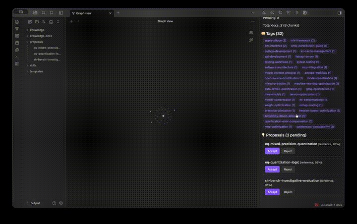
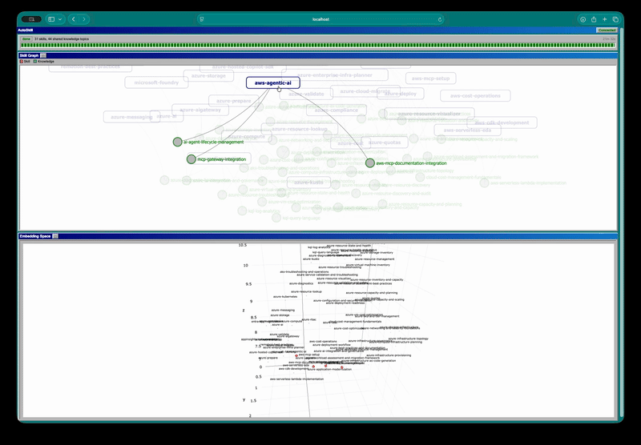
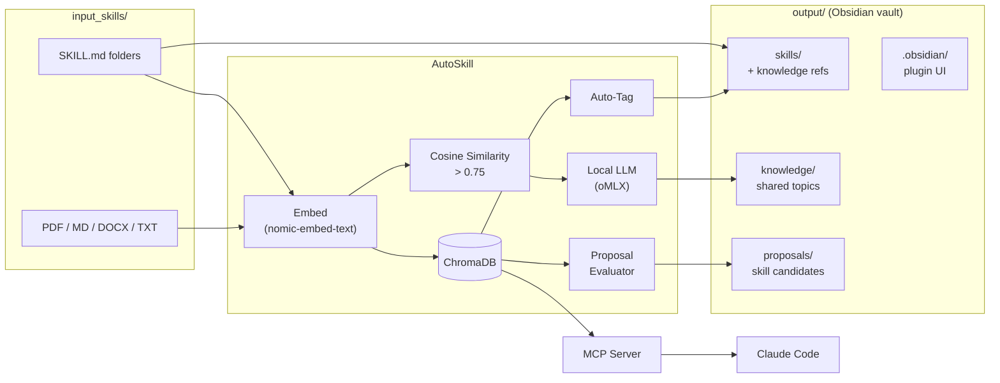

<h1 align="center">AutoSkill</h1>

<p align="center">
  <strong>Local knowledge graph + skill deduplication for AI agents</strong><br>
  <sub>Drop files in, get organized knowledge out — zero cloud dependency</sub>
</p>

<p align="center">
  
  
  
  
</p>


<p align="center">
  
</p>

---

AutoSkill watches a folder for AI agent skills and documents, deduplicates overlapping knowledge, builds a local vector-indexed knowledge graph, and proposes new skills — all running on your machine with a local LLM.

## Features

- **Skill Deduplication** — Detects overlapping skills via embeddings, extracts shared knowledge with LLM
- **Knowledge Indexing** — PDF, Markdown, DOCX, HTML, TXT parsed, chunked, and stored in ChromaDB
- **Auto-Tagging** — Two-tier: high-similarity inherits neighbor tags, otherwise local LLM assigns them
- **Skill Proposals** — Conservative LLM evaluation proposes new Claude Code skills from your documents
- **Live Dashboard** — Real-time skill graph, 3D embedding space, pipeline status
- **Obsidian Integration** — Output folder is your vault; bundled plugin shows tags, proposals, and search
- **MCP Server** — Claude Code queries your knowledge graph for passive augmentation
- **Fully Local** — Embeddings via sentence-transformers, LLM via oMLX / any OpenAI-compatible API

## Quick Start

```bash
uv sync
cp .env.example .env

# Index documents
uv run autoskill index input_skills/*.md input_skills/*.pdf --vault input_skills --output output

# Deduplicate skills
uv run autoskill ingest input_skills --output output

# Launch dashboard
uv run autoskill dashboard
# → http://localhost:8420
```

## Dashboard

<p align="center">
  
</p>

Interactive skill graph with shared knowledge nodes, 3D embedding scatter plot, and live pipeline progress.

## How It Works



**Skills** with cosine similarity > 0.75 get their shared knowledge extracted into standalone files. Each skill's frontmatter points back to the knowledge it references.

**Documents** are chunked, embedded, auto-tagged, and stored in ChromaDB. If a document looks like a reusable coding convention, a skill proposal is generated.

**Claude Code** connects via MCP to search your knowledge graph while working — passive augmentation with no manual lookups.

## Commands

| Command | Description |
|---------|-------------|
| `autoskill ingest <dir>` | Deduplicate skills, extract shared knowledge |
| `autoskill index <files>` | Index documents into knowledge graph |
| `autoskill watch <dir>` | Watch for new files, process continuously |
| `autoskill dashboard` | Launch web dashboard |
| `autoskill mcp-serve <vault>` | Start MCP server for Claude Code |
| `autoskill proposals` | List pending skill proposals |

## Configuration

```bash
# .env
LLM_MODEL=gemma-4-26b-a4b-it-4bit        # Any model via oMLX / Ollama / vLLM
LLM_URL=http://127.0.0.1:1111/v1/chat/completions
EMBED_MODEL=nomic-ai/nomic-embed-text-v1.5
SIMILARITY_THRESHOLD=0.75
```

## Architecture

```
cli.py                 Thin entry point
├── skills/            Skill parsing, dedup pipeline, writer
├── knowledge/         Doc parsing, chunking, ChromaDB, tagging, watcher
├── proposals/         LLM evaluation, progressive threshold tracking
├── mcp/               FastMCP server (7 tools)
├── dashboard/         FastAPI + D3 + Plotly
└── core/              Embedder, LLM client, config, progress
```

All data stored in `.skill-pipeline/` (ChromaDB + JSON). No cloud services required.

## Requirements

- Python 3.11+
- An OpenAI-compatible LLM API (oMLX, Ollama, vLLM, etc.)
- ~2GB disk for embedding model on first run

## License

MIT
